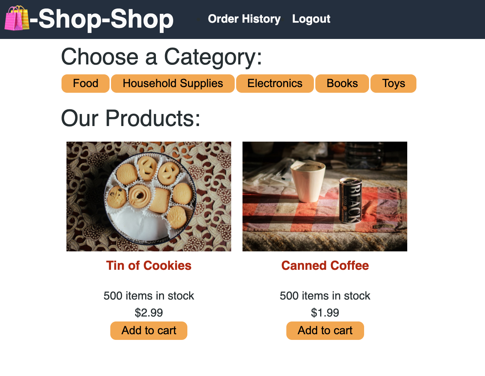

## Lekas Redux

Click here to open site:

## Converting a React’s Context API to Redux

This project involved going through React’s Context API already built application and converting the code to Redux code.

## Usage:
- npm start

Technologies

The following image demonstrates the web application's appearance:

To view the working app use the link below:

https://lekas-redux.herokuapp.com/

